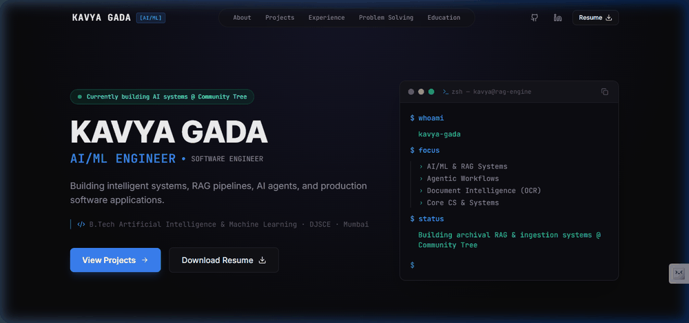

# Kavya Gada — AI/ML + Software Engineering Portfolio



Production-ready personal portfolio website for **Kavya Gada**, AI/ML Engineer. Built with Next.js 15, App Router, TypeScript, Tailwind CSS, Framer Motion, and Lucide React.

## 🚀 Features

- **Dark Theme Engineering Aesthetic**: Minimalist `#0a0a0c` dark mode palette with custom typography and subtle radial glow backdrops.
- **Interactive Terminal Micro-Card**: Live bash prompt micro-card showcasing key engineering focus areas with typing reveal animation and copy support.
- **System Architecture Visualizations**: Custom flow diagrams illustrating system design, OCR pipelines, dual-store RAG, and multi-agent workflows.
- **Dedicated Project Case Studies**: Deep-dive static routes (`/projects/[slug]`) for featured projects.
- **Verified Link Integrations**: GitHub, LinkedIn, LeetCode, HackerRank, NeetCode, Unstop, and Streamlit Community Tree live demo.
- **SEO & Accessibility**: Complete OpenGraph metadata, JSON-LD Person schema, dynamic `sitemap.xml`, `robots.txt`, and full keyboard navigation support.

---

## 💻 Tech Stack

- **Framework**: Next.js 15 (App Router, SSG)
- **Language**: TypeScript
- **Styling**: Tailwind CSS, PostCSS, Autoprefixer
- **UI Components & Icons**: Custom components, Lucide React
- **Animations**: Framer Motion
- **Fonts**: Google Fonts (Inter & JetBrains Mono)

---

## 🛠️ Getting Started

### Prerequisites

- Node.js 18+ or 20+
- npm, pnpm, or yarn

### Installation

1. Clone or download the repository:
   ```bash
   cd "My portfolio site"
   ```

2. Install dependencies:
   ```bash
   npm install
   ```

3. Run the development server:
   ```bash
   npm run dev
   ```

4. Open [http://localhost:3000](http://localhost:3000) in your browser.

---

## 🏗️ Production Build

To test or generate the optimized production build:

```bash
npm run build
npm run start
```

---

## 📁 Project Structure

```
src/
├── app/
│   ├── layout.tsx                # Root layout with fonts, metadata & JSON-LD
│   ├── page.tsx                  # Main homepage linking all portfolio sections
│   ├── projects/
│   │   └── [slug]/
│   │       └── page.tsx          # Case study SSG page template
│   ├── sitemap.ts                # Sitemap generator
│   ├── robots.ts                 # Search engine indexing rules
│   └── globals.css               # Global CSS & Tailwind imports
├── components/
│   ├── layout/
│   │   ├── navbar.tsx            # Fixed blur navbar & mobile menu
│   │   └── footer.tsx            # Minimal footer
│   ├── hero/
│   │   ├── hero.tsx              # 2-Column hero section
│   │   └── terminal-widget.tsx   # Interactive terminal micro-card
│   ├── about/
│   │   ├── about-section.tsx     # About overview & pillar cards
│   │   └── engineering-pillar-card.tsx
│   ├── projects/
│   │   ├── project-card.tsx      # Project card with architecture & stack
│   │   ├── project-grid.tsx      # Featured project grid
│   │   └── architecture-diagram.tsx # Workflow diagram component
│   ├── experience/
│   │   └── experience-timeline.tsx # Timeline for Community Tree & Robokart
│   ├── problem-solving/
│   │   ├── metric-card.tsx       # Metric achievement cards
│   │   └── problem-solving-section.tsx
│   ├── skills/
│   │   └── skills-section.tsx    # Categorized skill badges
│   ├── education/
│   │   └── education-section.tsx # DJSCE education card
│   ├── activities/
│   │   └── activities-section.tsx # Leadership & outreach automation
│   ├── contact/
│   │   └── contact-cta.tsx       # Final CTA block
│   └── ui/
│       ├── section-header.tsx
│       ├── status-badge.tsx
│       ├── tech-badge.tsx
│       └── cta-button.tsx
├── data/                         # Centralized typed data files
│   ├── portfolio.ts
│   ├── projects.ts
│   ├── experience.ts
│   └── skills.ts
├── types/
│   └── index.ts                  # Domain TypeScript interfaces
└── lib/
    └── utils.ts
public/
├── portfolio-demo.gif            # Animated site walkthrough demo
├── portfolio-preview.png         # Site preview screenshot
├── resume.pdf                    # Resume PDF placeholder
└── favicon.ico
```

---

## 📄 License

MIT License © 2026 Kavya Gada
